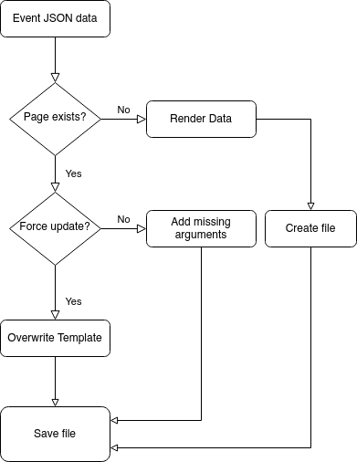

# wikirender
[](https://pypi.org/project/wikirender/)
[](https://github.com/tholzheim/wikirender/actions?query=workflow%3ABuild+branch%3Amaster)
[](https://github.com/tholzheim/wikirender/issues)
[](https://github.com/tholzheim/wikirender/issues/?q=is%3Aissue+is%3Aclosed)
[](https://www.apache.org/licenses/LICENSE-2.0)
[](https://pypi.python.org/pypi/wikirender/)

Provides jinja templates to create wiki page files form JSON input
## Install
```json
pip install wikirender
```
check if it worked with
```
wikirender -h
wikiextract -h
```
### Examples
#### wikiextract
Use this tool to extract template information from your wiki backup files.
```
wikiextract -t Event --BackupPath "/home/user/wikibackup/wikiId" -id "Filename"
```
Returns:
```JSON
{
   "data": [
      {
         "Acronym": "ICEIS 2011",
         "Title": "13th International Conference on Enterprise Information Systems (ICEIS)",
         "Type": "Conference",
         "Start date": "2011/06/08",
         "End date": "2011/06/11",
         "Homepage": "www.iceis.org/",
         "City": "Beijing",
         "Country": "China",
         "Submission deadline": "2011/01/25",
         "Filename": "ICEIS 2011"
      },
      {
         "  Title": " Foundations of Software Engineering 2001\n ",
         "  Type ": " Conference\n ",
         "  Field ": " Software engineering\n ",
         "  Series": " FSE\n ",
         "  Homepage": " esec.ocg.at/\n ",
         "  Logo": "\n ",
         "  Start date": "\n ",
         "  End date": "\n ",
         "  City": "\n ",
         "  State": "\n ",
         "  Country": "\n ",
         "  Submitted papers ": " 137\n ",
         "  Accepted papers ": " 29",
         "Filename": "FSE 2001"
      },
      {
         "Acronym": "CC 2009",
         "Title": "International Conference on Compiler Construction 2009",
         "Series": "CC",
         "Type": "Conference",
         "Field": "Computer science",
         "Start date": "2009/03/22",
         "End date": "2009/03/29",
         "Homepage": "http://www.brics.dk/~mis/CC2009/",
         "City": "York",
         "Country": "UK",
         "Submission deadline": "2008/10/02",
         "Filename": "CC 2009"
      }
}
```
> Note: As the name says the data is only extracted form the file. Meaning that also template arguments with invalid arguments are included in the result which is contrary to querying the templates in the wiki (invalid values are excluded there)

#### wikirender
##### wikirender -m create_entity_pages
In the mode create_entity_pages the following entity pages will be created (e.g. for <entity_name>)
* Concept:<entity_name>
* Category:<entity_name>
* Help:<entity_name>
* List of<entity_name_plural>
* Template:<entity_name>
* Form:<entity_name>

To generate the pages the following input is required:
* List of all entities the pages should be generated for
```JSON
{"data":[{
    "name": "Event",
    "pluralName": "Events",
    "icon": "File:EventLogo-64px.png",
    "iconUrl": "",
    "documentation": "a meeting of researchers at a specific time and place",
    "wikiDocumentation": "a meeting of researchers at a specific time and place (virtual or physical) and with a specific thematic focus to present, hear and discuss research outputs ",
  }]
}
```
*List of all properties of the wiki (all properties are required to extract dependencies between the properties)
```JSON
{"data":[{
  "property": "Property:Title",
  "name": "Title",
  "label": "Title",
  "type": "Special:Types/Text",
  "index": null,
  "sortPos": null,
  "inputType": "datetimepicker",
  "values_from": null,
  "used_for": "Concept:Event"
  }]
}
```
For the example input from above the following command generates **Concept.wiki**, **Category:Event.wiki**, **Help:Event.wiki**, **Form:Event.wiki**, **Template:Event.wiki** and, **List of Events.wiki**,
```
wikirender -m "generate_entity_pages" --BackupPath . --topics topics.json --properties properties.json
```
##### Pipeline Example
Example pipeline to generate enity pages for all topics in the wiki with the use of [py-3rdparty-mediawiki](https://github.com/WolfgangFahl/py-3rdparty-mediawiki)
```
$ bash scripts/gen -t <wikiId> &&
wikirender -m "generate_entity_pages" --BackupPath . --topic /tmp/wikirender/<wikiId>/topics.json --properties /tmp/wikirender/<wikiId>/properties.json &&
wikirestore -t <wikiId> --backupPath .
```

#### Example Pipeline
For example, we have a json file with information about events with which we want to update the Event templates in the wikibackup.
```
cat test.json | wikirender -t Event -id Acronym -stdin --BackupPath "."
```
The data is provided to wikirender through *stdin* and updates the template *Event* with the provided data.
As page name the key *Acronym* is used.
The update to the templates is applied to the files as shown in the diagram below.


#### Sample Input Data
```json
{
    "data":
    [
        {
            "Acronym": "SMWCon 2020",
            "Title": "SMWCon",
            "Year": "2020",
            "Description": "test value"
        },
        {
            "Acronym": "SMWCon 2021",
            "Title": "SMWCon",
            "Year": "2021",
            "Description": "test value\\n with line break"
        }
    ]
}
```
